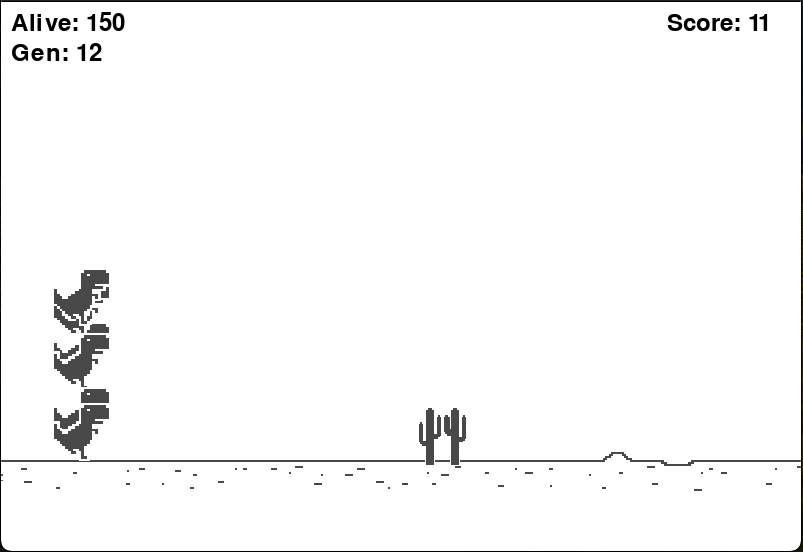

# AI Google dino

AI Google dino, a Python-based implementation of the classic Google dino game, enhanced with an AI component using NEAT (NeuroEvolution of Augmenting Topologies). The AI learns to play the game through evolution, improving its performance over generations.



## Table of Contents

- [Features](#features)
- [Dependencies](#dependencies)

## Features

- **AI Player**: Uses NEAT to evolve neural networks that control the bird.
- **User Player**: Space bar to jump, the user controls the bird.
- **User Interface**: Pygame-based UI with smooth graphics and animations.
- **Dynamic Environment**: Pipes spawn randomly, making the game more challenging.
- **Score Tracking**: Keeps track of the score based on pipes passed.

### Dependencies

To run this project, you'll need Python installed on your machine, along with the necessary dependencies.

Make sure you have the following installed:

- Python 3.x
- Pygame library
- NEAT-Python library

1. In your terminal run:
```bash
pip install pygame
pip install neat-python 
```

2. Clone the repository:
   ```bash
    git clone https://github.com/NoamBeiruty15/AI-flappy-bird
    ``` 